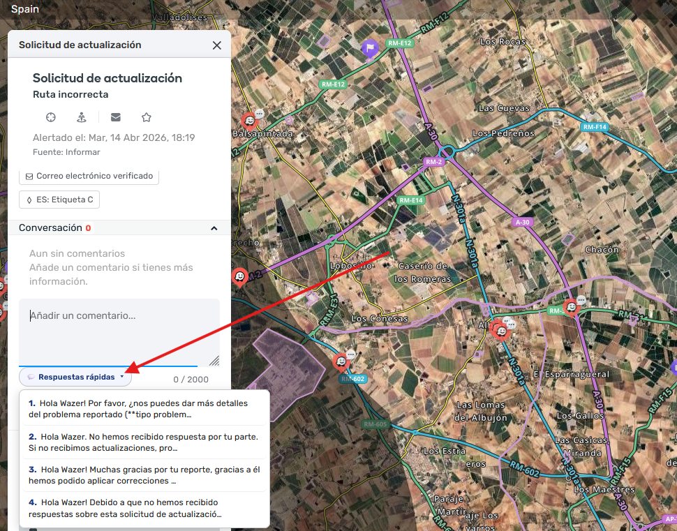
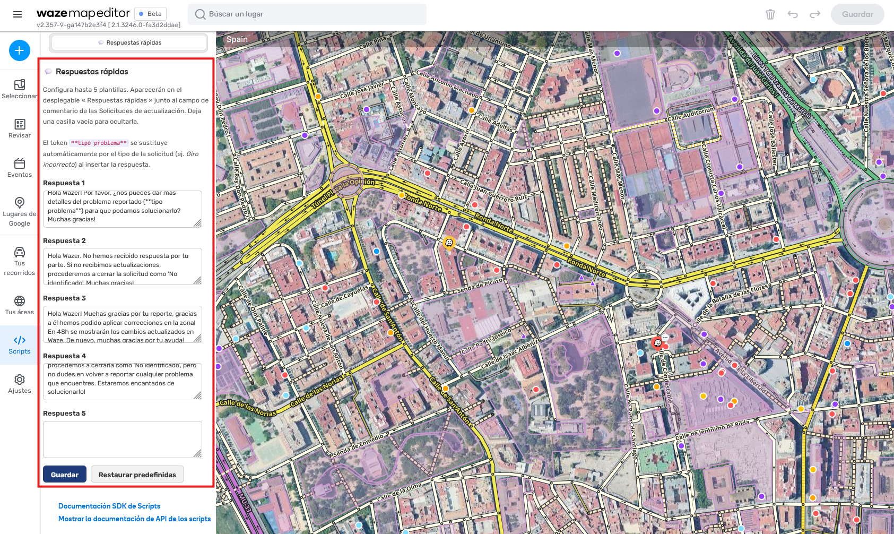

# WME Quick Replies

A userscript for [Waze Map Editor (WME)](https://www.waze.com/editor) that adds a
**Quick replies** dropdown button to the conversation field of Update Requests (URs),
so you can answer reporters with one click instead of retyping the same messages.

> 🇪🇸 Plantillas de respuestas rápidas para las Solicitudes de actualización (UR) del
> Waze Map Editor. Responde a los reportes con un clic.

## Features

- 💬 **Quick replies button** right next to the UR comment character counter.
- ✍️ **Up to 5 editable templates**, managed from a dedicated **Scripts** tab inside WME
  (no need to edit the code).
- 🧩 **Problem-type token**: write `**problem type**` (or your language's token) in a
  template and it is automatically replaced with the actual UR type
  (e.g. *Turn not allowed*, *Giro incorrecto*).
- 🧹 **Clears the field first**: selecting a reply replaces the field content instead of
  appending to it.
- 🌍 **Multilingual** — the UI, default templates and token auto-adapt to the editor
  language: **English (default), Español, Français, Português, Deutsch**.
- ⚡ **Lightweight** — the button is cached, so it doesn't slow the editor down.

## Installation

1. Install a userscript manager: [Tampermonkey](https://www.tampermonkey.net/)
   (recommended) or [Violentmonkey](https://violentmonkey.github.io/).
2. Install the script:
   - From **Greasy Fork**: *(add your Greasy Fork link here once published)*
   - Or manually: open
     [`WME-Quick-Replies.user.js`](WME-Quick-Replies.user.js) → **Raw** → your userscript
     manager will offer to install it.
3. Open the [Waze Map Editor](https://www.waze.com/editor) and you're done.

## Usage

1. Open any **Update Request**.
2. Click **💬 Quick replies** next to the comment box and pick a template.
3. Edit your templates anytime from the **💬 Quick Replies** tab in the WME left sidebar
   (Scripts section). Click **Save**.

### The problem-type token

| Language | Token to write in your template |
|----------|---------------------------------|
| English  | `**problem type**`              |
| Español  | `**tipo problema**`             |
| Français | `**type de problème**`          |
| Português| `**tipo de problema**`          |
| Deutsch  | `**Problemtyp**`                |

When you insert the reply, the token is replaced with the real UR type shown in the panel.

## Settings

You can personalise all 5 reply templates **without touching the code**, from the
**💬 Quick Replies** tab inside WME:

1. Open the **left sidebar** in WME and go to the **Scripts** section.
2. Select the **💬 Quick Replies** tab.
3. Edit any of the 5 text boxes and click **Save**.
   - Leave a box **empty** to hide that reply from the dropdown.
   - Use **Restore defaults** to reset the templates to the defaults for your language.

Tip: this is also where you add the [problem-type token](#the-problem-type-token) to a
template so it gets replaced with the real UR type.

## Language detection

The script reads the editor locale from the URL (e.g. `/es-ES/editor`, `/fr/editor`)
and the document `lang` attribute. If the language isn't one of the supported ones, it
falls back to **English**.

## Contributing translations

Want to add a language or refine a translation? Edit three blocks near the top of
`WME-Quick-Replies.user.js`:

1. `SUPPORTED` — add the 2-letter code.
2. `I18N` — add the UI strings.
3. `DEFAULTS` — add the 5 default templates.

Pull requests welcome!

## License

[MIT](LICENSE) © Daniel Alonso
